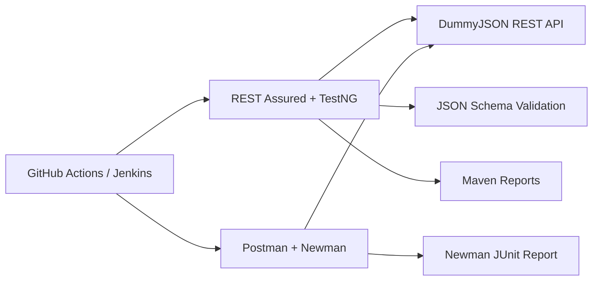

# API Automation Architecture

```mermaid
flowchart LR
  CI[GitHub Actions / Jenkins] --> RA[REST Assured + TestNG]
  CI --> NM[Postman + Newman]
  RA --> API[DummyJSON REST API]
  NM --> API
  RA --> SC[JSON Schema Validation]
  RA --> MR[Maven Reports]
  NM --> NR[Newman JUnit Report]
```

Two independent execution paths demonstrate both code-first API automation and collection-based API automation.
